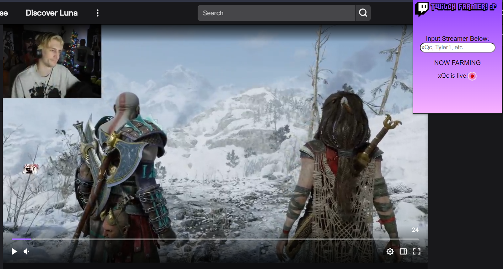

# TwitchFarmer
⠄⠄⠄⠄⠄⠰⣿⣿⣿⣿⣶⠶⠤⠄⠄⣶⣶⣤⣀⣀⠄⠄⠄⠄⠄⠄⠄⠄⠄⠄
⠄⠄⠄⠄⠄⠄⠈⠻⣿⣿⣰⣿⣿⣿⣶⣬⠝⠻⢯⣥⣶⣶⠄⣀⡀⠄⠄⠄⠄⠄
⠄⠄⠄⠄⠄⠄⠄⠄⠈⢿⣿⣿⣿⡟⣫⠶⣚⣓⣒⠌⢛⡵⢋⣵⠶⢦⡀⠄⠄⠄
⠄⠄⠄⠄⢠⢒⣉⣑⠢⣾⣿⣿⣿⡟⢩⣾⣿⡿⠛⢿⣮⠱⣿⣿⠠⡄⠹⡄⠠⠤
⠄⠄⠄⠄⢻⣯⣶⣿⣿⣦⣙⠿⠿⠿⠆⠋⠉⠄⠄⠄⢠⡄⠄⠉⠄⠁⠄⠄⠄⠄
⠄⢀⣤⣾⣿⣿⣏⣭⣭⣿⣿⡆⠄⠄⠄⠄⠄⠄⠄⠄⠼⣅⠄⠄⠄⠄⠄⠄⠄⣠
⠺⣿⣿⣿⢟⣵⡿⢿⣷⣮⡻⢿⣷⣦⣤⣤⣤⣤⣤⣵⣿⣿⣿⣮⣻⡿⠶⣚⠔⠄
⠄⠈⠻⣿⢸⣿⡕⣷⣬⡻⢿⣷⣬⣛⠿⠿⠿⠿⠿⠿⠿⠿⣛⣫⣥⠶⠛⠁⠄⠄
⠄⠄⠄⠈⠁⠻⢿⣮⡉⠉⠓⠶⣮⣭⣛⣛⣛⣛⣛⠛⠛⠉⠉⠄⣰⡿⠁⠄⠄⠄
⠄⠄⠄⠄⠄⠄⠄⠈⠉⠓⠒⠠⣄⣉⣙⣛⣛⣋⣁⣠⠤⠴⠖⢟⡁⠄⠄⠄⠄⠄
⠄⠄⠄⠄⠄⠄⠄⠄⠄⠄⠄⠄⠄⠄⣨⣭⣭⠵⠶⠒⠉⠄⠄⠄⠈⠑⠢⡄⠄⠄
⠄⠄⠄⠄⠄⠄⠄⠄⠄⠄⠄⠄⠄⢰⣷⣶⠶⣫⣼⣦⡄⠄⠄⠄⠄⡴⠋⠄⠄⠄

Pre-Release 1.0

Prototype Chrome extension that allows users to track when streamers go live and automatically open a tab to farm chat points in the background.
Extension will interface directly with Twitch API hosted on an external server and update stream status every ~30 seconds.

TODO: 
// Express Server hosting twitch.js to receive API calls.
// Multi-streamer input, stored via arrays
// Auto-click functionality (currently can be paired with the Twitch Channel Points Auto-Clicker Extension)
// Live status + Viewer count display

